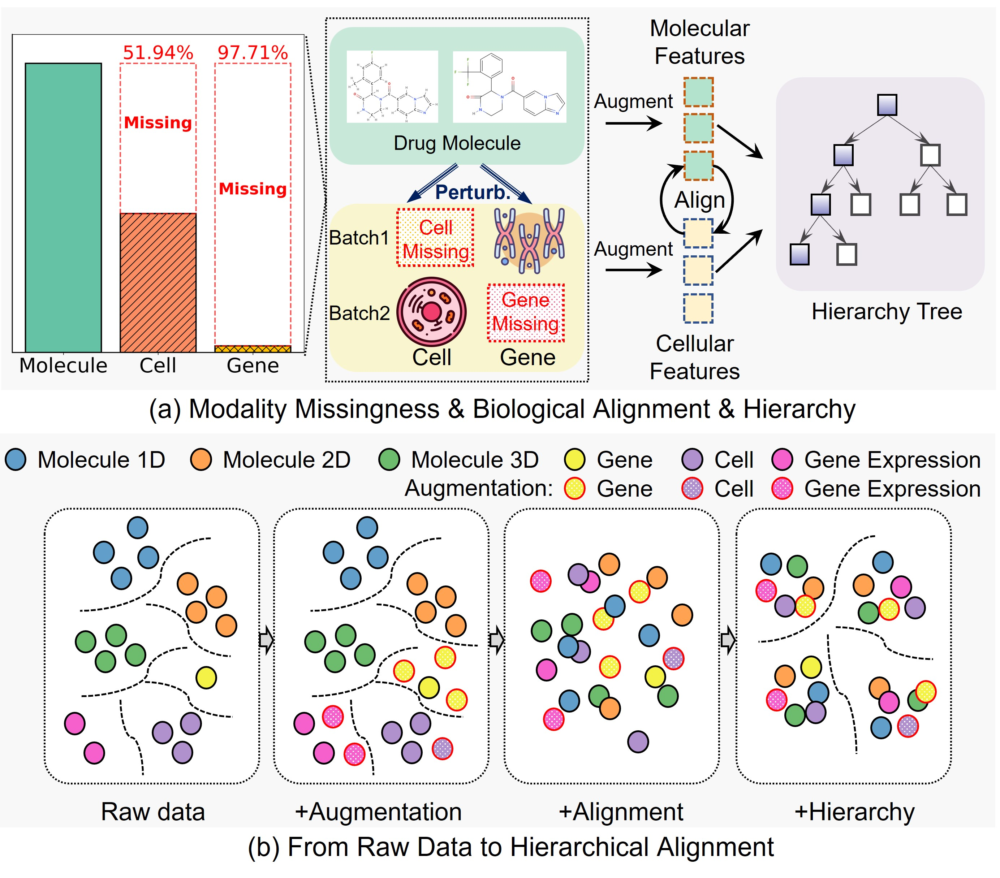

# 🚀 Pretraining and Fine-tuning for CHMR


This repository contains the implementation for **CHMR**, a structure-aware molecular representation model.

<div align="center">
  
  <p><em>Molecular perturbations trigger cellular or genetic changes, but modality incompleteness is common. 
  Through augmentation, alignment, and hierarchical modeling, multi-modal representations are progressively organized and structured — forming the core motivation of this work.</em></p>
</div>

---

## 📁 Directory Structure

### 🔧 Data Preparation

Create a folder named `raw_data` and extract the pretraining data into it.

**Download the dataset** from [Zenodo](https://zenodo.org/records/17303120).

Unzip the `pretrain.zip` file and place all contents inside the `raw_data/` directory.


---

## 🛠 Requirements

Make sure to install all required dependencies.  

```bash
# 1️⃣ Upgrade pip
pip install --upgrade pip

# 2️⃣ Install PyTorch 2.0.1 (CUDA 11.8)
pip install torch==2.0.1+cu118 torchvision==0.15.2+cu118 --index-url https://download.pytorch.org/whl/cu118

# 3️⃣ Install PyTorch Geometric dependencies
pip install torch-scatter==2.1.1 torch-sparse==0.6.17 torch-cluster==1.6.3 torch-spline-conv==1.2.2 \
  -f https://data.pyg.org/whl/torch-2.0.1+cu118.html

# 4️⃣ Install torch_geometric
pip install torch_geometric==2.5.2

# 5️⃣ Install remaining dependencies
pip install -r requirements.txt
````

---

## 🧪 Pretraining

To start the pretraining process, run:

```bash
python pretrain.py \
  --model-path "CHMR.pt" \
  --lr 1e-4 \
  --wdecay 1e-8 \
  --epoch 50 \
  --batch-size 3072 \
  --lambda_1 10 \
  --lambda_2 10
```

### 🔧 Pretraining Parameters

| Argument       | Description                                    |
| -------------- | ---------------------------------------------- |
| `--model-path` | Path to save the pretrained model (`.pt` file) |
| `--lr`         | Learning rate                                  |
| `--wdecay`     | Weight decay                                   |
| `--epoch`      | Number of pretraining epochs                   |
| `--batch-size` | Training batch size                            |
| `--lambda_1`   | Weight for the SCA module                      |
| `--lambda_2`   | Weight for the Tree-VQ module                  |

---

## 🧬 Fine-tuning

After pretraining, we fine-tune the model on **9 molecular property prediction datasets**.

For **BACE, ClinTox, SIDER, and HIV**, we apply a **structure-aware ensemble strategy**, which integrates CHMR predictions with a random forest baseline trained on the same split.

### 🔁 Ensemble Workflow

1. Generate random forest predictions:

   ```bash
   python random_forest/extract_fingerprint.py --dataset [ogbg-molbace | ogbg-molclintox | ogbg-molsider | ogbg-molhiv]
   python random_forest/random_forest.py --dataset [ogbg-molbace | ogbg-molclintox | ogbg-molsider | ogbg-molhiv]
   ```

   The output `rf_pred.npy` will be saved in:

   ```
   raw_data/[dataset]/raw/rf_pred.npy
   ```

---

## 📊 Fine-tuning Hyperparameters

| Dataset | LR   | Dropout | γ | Hidden | Batch Size | Patience | Epoch | Norm      | λ₁   | λ₂  |
| ------- | ---- | ------- | ----- | ------ | ---------- | -------- | ----- | --------- | ---- | --- |
| ChEMBL  | 1e-3 | 0.9     | –     | 1800   | 5120       | 50       | 300   | LayerNorm | 10   | 0.1 |
| ToxCast | 1e-2 | 0.8     | –     | 1800   | 5120       | 50       | 300   | LayerNorm | 1    | 0.1 |
| Broad   | 2e-3 | 0.8     | –     | 1800   | 5120       | 50       | 300   | LayerNorm | 10   | 10  |
| BBBP    | 1e-3 | 0.5     | –     | 2400   | 5120       | 50       | 300   | LayerNorm | 10   | 10  |
| BACE    | 5e-4 | 0.5     | 0.005 | 1800   | 16         | 5        | 100   | BatchNorm | 0.01 | 0.1 |
| ClinTox | 5e-3 | 0.9     | 0.01  | 2400   | 32         | 5        | 100   | LayerNorm | 0.1  | 10  |
| SIDER   | 5e-4 | 0.2     | 0.1   | 1200   | 5120       | 20       | 30    | BatchNorm | 10   | 10  |
| HIV     | 1e-3 | 0.8     | 0.001 | 1800   | 10240      | 50       | 300   | BatchNorm | 10   | 10  |
| Biogen  | 2e-3 | 0.8     | –     | 1200   | 5120       | 50       | 300   | LayerNorm | 10   | 1   |

---

## 💻 Fine-tuning Commands

### 🔹 Biogen Example

```bash
python finetune.py \
  --model-path CHMR.pt \
  --dataset finetune-biogenadme \
  --lr 2e-3 \
  --hidden 4 \
  --batch-size 5120 \
  --task_dropout 0.8
```

You can also substitute `--dataset` with:

* `finetune-chembl2k`
* `finetune-moltoxcast`
* `finetune-board6k`
* `finetune-molbbbp`

### 🔹 BACE Example (with ensemble)

```bash
python finetune.py \
  --model-path HCMR.pt \
  --dataset finetune-molbace \
  --lr 5e-4 \
  --gamma 0.005 \
  --hidden 6 \
  --batch-size 16 \
  --task_dropout 0.5
```

You can also replace the dataset with:

* `finetune-molclintox`
* `finetune-molsider`
* `finetune-molhiv`

---

